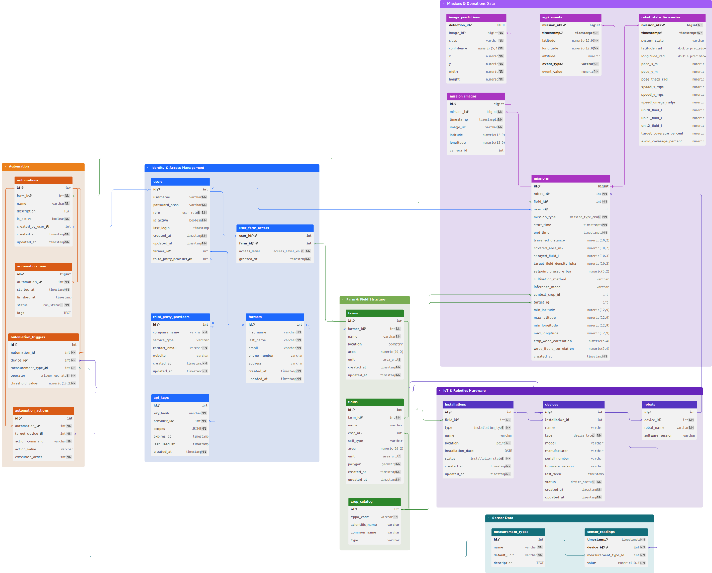

# Data Lake Documentation
**ICCS - NTUA**

## Introduction

In this document we will explore the architecture of the Data Lake of our project and the ways that we can use it to safely store the data of every use case. We will see ways that we can experiment with the API it provides locally and how to contribute to its betterment.

## Contents

*   [Data Lake Abstract Architecture](#data-lake-abstract-architecture)
*   [Relational Schema](#relational-schema)
*   [The API](#the-api)
*   [Local experimentation with the API](#local-experimentation-with-the-api)
*   [Pilot Case 1 - Weed identification and spot spraying](#pilot-case-1---weed-identification-and-spot-spraying)
*   [Pilot Case 2 - Robotic spraying of weeds in potato and volunteer potatoes](#pilot-case-2---robotic-spraying-of-weeds-in-potato-and-volunteer-potatoes)
*   [Pilot Case 3 - Robotic fertilization management for leafy vegetables](#pilot-case-3---robotic-fertilization-management-for-leafy-vegetables)
*   [Pilot Case 4 - Robotic technologies for crop monitoring in soilless tomato cultivation](#pilot-case-4---robotic-technologies-for-crop-monitoring-in-soilless-tomato-cultivation)
*   [Pilot Case 5 - Robotic harvesting in orchards](#pilot-case-5---robotic-harvesting-in-orchards)
*   [Pilot Case 6 - Robotic pruning and thinning with XR in orchards](#pilot-case-6---robotic-pruning-and-thinning-with-xr-in-orchards)

---

## Data Lake Abstract Architecture

<p align="center">
  
</p>

### Postgres
PostgreSQL is a powerful, open-source relational database management system. It is known for its robustness, reliability, and support for advanced data types and performance optimization features. Our data lake uses PostgreSQL to save relational data (time series, geospatial, etc.).

### MinIO
MinIO is an open-source, high-performance, distributed object storage system. It is designed to store unstructured data such as photos and videos.

### The API
To communicate with the Data Lake we have set up an API using **FastAPI**. It handles ingesting and serving information, acting as a connector between Farm Robots/Sensors, Dashboards/AR Applications, and the Multi-Cloud storage.

---

## Relational Schema

<p align="center">
  
</p>

**Additional Information:**
*   You can view the schema [here](https://dbdiagram.io/d/AgRibot-6849f4b1a463a450da2514f5) 
*   Details about the DB can be found [here](https://dbdocs.io/iloudaros/AgRibot)

---

## The API

### Local experimentation with the API
To start experimenting with the API:
1.  Visit `https://github.com/iloudaros/agribot-data`
2.  Follow the instructions to create a local instance of it using Minikube.

*In case you encounter a 404 error with the link above, chances are you are not listed as a contributor at the repository. Please send an email to `iloudaros@microlab.ntua.gr` and we will sort it out.*

---

## Pilot Case 1 - Weed identification and spot spraying
**Partner:** AUA

*[not enough information yet]*

---

## Pilot Case 2 - Robotic spraying of weeds in potato and volunteer potatoes
**Partner:** Ecorobotix

### Objective
To ingest a complete mission summary from an Ecorobotix system. This involves combining data from two separate JSON files (`mission_data.json` and `mission_metadata.json`) into a single API call to create a new record in the `missions` table.

### Source Files
*   `data_samples/UC2/Ecorobotix/mission_data.json`: Contains the core operational data of the mission.
*   `data_samples/UC2/Ecorobotix/mission_metadata.json`: Contains supplementary metadata and boundary information.

### Data Mapping and Pre-processing

| JSON Field | Example Value | Pre-processing step | API Body field | Database Column |
| :--- | :--- | :--- | :--- | :--- |
| `start_time_ms` | 1747408062392 | Convert ms epoch to ISO 8601 | `start_time` | `start_time` |
| `end_time_ms` | 1747408439367 | Convert ms epoch to ISO 8601 | `end_time` | `end_time` |
| `robot_id` | "erxbot-1910" | Look up id from robots table | `robot_id` | `robot_id` |
| `field_name` | "26" | Look up id from fields table | `field_id` | `field_id` |
| `context_eppo` | "DAUCA" | Look up id from crop_catalog table | `context_crop_id` | `context_crop_id` |
| `target_eppo` | "WEED" | Look up id from crop_catalog table | `target_id` | `target_id` |
| `travelled_distance_m` | 418.86887 | Direct mapping | `travelled_distance_m` | `travelled_distance_m` |
| `covered_area_m2` | 2574.026 | Direct mapping | `covered_area_m2` | `covered_area_m2` |
| `sprayed_fluid_l` | 5.3678803 | Direct mapping | `sprayed_fluid_l` | `sprayed_fluid_l` |
| `max_lat` | 46.96215985 | Direct mapping | `max_latitude` | `max_latitude` |
| `min_lat` | 46.95933422 | Direct mapping | `min_latitude` | `min_latitude` |
| `max_long` | 7.14054517 | Direct mapping | `max_longitude` | `max_longitude` |
| `min_long` | 7.13690217 | Direct mapping | `min_longitude` | `min_longitude` |
| `crop_weed_correlation` | 0.62 | Direct mapping | `crop_weed_correlation` | `crop_weed_correlation` |
| `weed_liquid_correlation` | 0.74 | Direct mapping | `weed_liquid_correlation` | `weed_liquid_correlation` |

### Affected DB Tables
This use case primarily creates a record in the `missions` table but relies on several other tables for foreign key lookups.

*   **missions:** Primary Storage. A new row is created here containing the combined and processed data from the API call.
*   **users:** Authentication. The API request must be authenticated, and the `user_id` of the authenticated user is stored in the new missions record.
*   **robots:** Foreign Key Lookup. Used to convert the robot name (e.g., "erxbot-1910") into its integer primary key (`robot_id`).
*   **fields:** Foreign Key Lookup. Used to convert the field name (e.g., "26") into its integer primary key (`field_id`).
*   **crop_catalog:** Foreign Key Lookup. Used to convert EPPO codes (e.g., "DAUCA", "WEED") into their integer primary keys (`context_crop_id`, `target_id`).

### API Endpoint
`POST /api/v1/missions/`

This endpoint creates a new mission summary. It requires authentication and expects a request body conforming to the `MissionCreate` model.

### Examples

**curl Example**
```bash
curl -X POST "http://127.0.0.1:8080/api/v1/missions/" \
-H "Authorization: Bearer $TOKEN" \
-H "Content-Type: application/json" \
-d '{
"robot_id": 1,
"field_id": 1,
"mission_type": "spraying",
"start_time": "2025-05-18T10:07:42.392Z",
"end_time": "2025-05-18T10:13:59.367Z",
"travelled_distance_m": 418.87,
"covered_area_m2": 2574.03,
"sprayed_fluid_l": 5.368,
"target_fluid_density_lpha": 200.0,
"setpoint_pressure_bar": 3.0,
"cultivation_method": "RIDGES",
"inference_model": "DAUCA/8",
"context_crop_id": 1,
"target_id": 3,
"min_latitude": 46.95933422,
"max_latitude": 46.96215985,
"min_longitude": 7.13690217,
"max_longitude": 7.14054517,
"crop_weed_correlation": 0.62,
"weed_liquid_correlation": 0.74
}'
```

**Python Example**
```python
import requests
import json
from datetime import datetime, timezone

# --- Configuration ---
API_BASE_URL = "http://127.0.0.1:8080"
# Replace with a valid token obtained from the /token endpoint
ACCESS_TOKEN = "YOUR_JWT_ACCESS_TOKEN"
HEADERS = {
    "Authorization": f"Bearer {ACCESS_TOKEN}",
    "Content-Type": "application/json"
}

# --- Pre-processing & Lookups (Simulated) ---
# In a real application, these values would be fetched from your database.
# For this example, we'll use the IDs created by the db/seeds.sql script.
robot_id_map = {"erxbot-1910": 1}
field_id_map = {"26": 1}
crop_id_map = {"DAUCA": 1, "WEED": 3}

def ingest_ecorobotix_mission(mission_data_path, metadata_path):
    """
    Loads, combines, processes, and ingests an Ecorobotix mission.
    """
    print("1. Loading source JSON files...")
    with open(mission_data_path, 'r') as f:
        mission_data = json.load(f)
    with open(metadata_path, 'r') as f:
        metadata = json.load(f)

    print("2. Processing and combining data...")
    try:
        # Combine data from both files into a single payload
        payload = {
            # Perform ID lookups
            "robot_id": robot_id_map.get(mission_data["robot_id"]),
            "field_id": field_id_map.get(mission_data["field_name"]),
            "context_crop_id": crop_id_map.get(mission_data["context_eppo"]),
            "target_id": crop_id_map.get(mission_data["target_eppo"]),
            # Convert timestamps from milliseconds to ISO 8601 UTC format
            "start_time": datetime.fromtimestamp(mission_data["start_time_ms"] / 1000, tz=timezone.utc).isoformat(),
            "end_time": datetime.fromtimestamp(mission_data["end_time_ms"] / 1000, tz=timezone.utc).isoformat(),
            # Map fields directly
            "mission_type": "spraying", # Assuming based on context
            "travelled_distance_m": mission_data["travelled_distance_m"],
            "covered_area_m2": mission_data["covered_area_m2"],
            "sprayed_fluid_l": mission_data["sprayed_fluid_l"],
            "target_fluid_density_lpha": mission_data["target_fluid_surface_density_lpha"],
            "setpoint_pressure_bar": mission_data["setpoint_pressure_bar"],
            "cultivation_method": mission_data["cultivation_method"],
            "inference_model": mission_data["inference_model"],
            "min_latitude": metadata["min_lat"],
            "max_latitude": metadata["max_lat"],
            "min_longitude": metadata["min_long"],
            "max_longitude": metadata["max_long"],
            "crop_weed_correlation": metadata["crop_weed_correlation"],
            "weed_liquid_correlation": metadata["weed_liquid_correlation"]
        }
    except KeyError as e:
        print(f"ERROR: A required key is missing from the source files: {e}")
        return

    print("3. Posting data to the API...")
    try:
        response = requests.post(f"{API_BASE_URL}/api/v1/missions/", headers=HEADERS, json=payload)
        response.raise_for_status() # Raise an exception for bad status codes (4xx or 5xx)
        print("✅ Success! Mission created.")
        print("Response:", json.dumps(response.json(), indent=2))
    except requests.exceptions.RequestException as e:
        print(f"❌ API call failed: {e}")
        if e.response:
            print("Error details:", e.response.text)

if __name__ == "__main__":
    if ACCESS_TOKEN == "YOUR_JWT_ACCESS_TOKEN":
        print("Please update the ACCESS_TOKEN variable in the script before running.")
    else:
        ingest_ecorobotix_mission(
            'data_samples/UC2/Ecorobotix/mission_data.json',
            'data_samples/UC2/Ecorobotix/mission_metadata.json'
        )
```

---

## Pilot Case 3 - Robotic fertilization management for leafy vegetables in open field conditions
**Partner:** POLIBA

### Objective
To ingest a batch of time-series event data from a CSV file. This data represents discrete events recorded during a mission, such as weed detection counts at specific geographic coordinates. This data is appended to an existing mission.

### Source Files
*   `data_samples/UC3 & UC4/sample_file_uc3_uc4.csv`: A CSV file where each row contains a timestamp, geographic coordinates, and a numeric value.

### Data Mapping and Pre-processing
The raw CSV data must be parsed and structured into a JSON payload that matches the API’s `AgriEvent` model. This is a batch operation; many CSV rows are sent in a single API call.

A crucial pre-processing step is to define an `event_type`. Since the CSV file only contains raw numbers, we must give them context. For this use case, we will define the type as “detection-count”.

| JSON Field | Example Value | Pre-processing step | API Body field | Database Column |
| :--- | :--- | :--- | :--- | :--- |
| Column 1 | 1631269580.973 | Convert Unix epoch to ISO 8601 | `timestamp` | `timestamp` |
| Column 2 | 40.45422209 | Direct mapping (as float) | `latitude` | `latitude` |
| Column 3 | 17.90726559 | Direct mapping (as float) | `longitude` | `longitude` |
| Column 4 | 87.025999 | Direct mapping (as float) | `altitude` | `altitude` |
| Column 5 | 6 | Direct mapping (as float/int) | `event_value` | `event_value` |
| (N/A) | (N/A) | Define a string literal | `event_type` | `event_type` |

### Affected DB Tables
This use case adds new rows to the `agri_events` table.

*   **agri_events:** Primary Storage. One or more new rows are created here, one for each event sent in the batch.
*   **missions:** Foreign Key Prerequisite. The `mission_id` in the API path must correspond to an existing record in this table. This operation does not create a new mission; it only adds data to one.
*   **users:** Authentication. The request must be authenticated by a valid user token.

### API Endpoint
`POST /api/v1/missions/{mission_id}/agri_events`

This endpoint accepts a list of `AgriEvent` objects in the request body and associates them with the `mission_id` specified in the URL path.

### Examples

**curl Example**
```bash
curl -X POST "http://127.0.0.1:8080/api/v1/missions/1/agri_events" \
-H "Authorization: Bearer $TOKEN" \
-H "Content-Type: application/json" \
-d '[
{
"timestamp": "2021-09-10T10:26:20.973Z",
"latitude": 40.4542221,
"longitude": 17.9072656,
"altitude": 87.026,
"event_type": "detection_count",
"event_value": 6
},
{
"timestamp": "2021-09-10T10:26:21.974Z",
"latitude": 40.4542220,
"longitude": 17.9072655,
"altitude": 87.018,
"event_type": "detection_count",
"event_value": 9
}
]'
```

**Python Example**
```python
import requests
import json
import csv
from datetime import datetime, timezone

# --- Configuration ---
API_BASE_URL = "http://127.0.0.1:8080"
# Replace with a valid token obtained from the /token endpoint
ACCESS_TOKEN = "YOUR_JWT_ACCESS_TOKEN"
HEADERS = {
    "Authorization": f"Bearer {ACCESS_TOKEN}",
    "Content-Type": "application/json"
}

# The ID of the mission to which we are adding events
TARGET_MISSION_ID = 1

def ingest_agri_events(csv_file_path, mission_id):
    """
    Reads event data from a CSV, processes it, and sends it to the API
    as a single batch.
    """
    print(f"1. Reading data from source file: {csv_file_path}")
    agri_events = []
    try:
        with open(csv_file_path, 'r') as f:
            reader = csv.reader(f)
            for row in reader:
                # Create one AgriEvent object per row
                event = {
                    "timestamp": datetime.fromtimestamp(float(row[0]), tz=timezone.utc).isoformat(),
                    "latitude": float(row[1]),
                    "longitude": float(row[2]),
                    "altitude": float(row[3]),
                    "event_type": "detection_count", # Assigning a type to the value
                    "event_value": float(row[4])
                }
                agri_events.append(event)
    except FileNotFoundError:
        print(f"❌ ERROR: The file was not found at {csv_file_path}")
        return
    except (ValueError, IndexError) as e:
        print(f"❌ ERROR: Could not process a row in the CSV file. Check data format. Error: {e}")
        return

    if not agri_events:
        print("No events found in the file. Nothing to send.")
        return

    print(f"2. Processed {len(agri_events)} events. Posting batch to mission ID {mission_id}...")
    try:
        api_url = f"{API_BASE_URL}/api/v1/missions/{mission_id}/agri_events"
        response = requests.post(api_url, headers=HEADERS, json=agri_events)
        response.raise_for_status()
        print("✅ Success! Batch of agri-events added.")
        print("Response:", json.dumps(response.json(), indent=2))
    except requests.exceptions.RequestException as e:
        print(f"❌ API call failed: {e}")
        if e.response:
            print("Error details:", e.response.text)

if __name__ == "__main__":
    if ACCESS_TOKEN == "YOUR_JWT_ACCESS_TOKEN":
        print("Please update the ACCESS_TOKEN variable in the script before running.")
    else:
        ingest_agri_events(
            'data_samples/UC3 & UC4/sample_file_uc3_uc4.csv',
            TARGET_MISSION_ID
        )
```

---

## Pilot Case 4 - Robotic technologies for crop monitoring and management in soilless tomato cultivation
**Partner:** POLIBA

*[Same as Pilot Case 3]*

---

## Pilot Case 5 - Robotic harvesting in orchards
**Partner:** KUL

### Objective
To ingest a batch of object detection predictions (e.g., detected fruit) from a JSON file and associate them with a specific image from a mission.

### Prerequisite
Before predictions can be added, the image they correspond to must already exist in the database. This is typically done by making a POST request to the `/api/v1/missions/{mission_id}/images` endpoint. This call uploads the image file, creates a record in the `mission_images` table, and returns the unique `image_id` needed for this use case.

### Source Files
*   `data_samples/UC5 &UC6/EUT/thinning_output.json`: A JSON file containing an array of detected objects, each with bounding box coordinates, a class label, and a confidence score.

### Data Mapping and Pre-processing
The API endpoint expects a direct list of prediction objects. The source JSON file contains a top-level object with a `predictions` key, so the value of this key (the list) must be extracted to become the request body.

A key detail is the mapping of the `class` field. Since `class` is a reserved keyword in Python, the API model uses the alias `class_name`.

| JSON Field | Example Value | Pre-processing step | API Body field | Database Column |
| :--- | :--- | :--- | :--- | :--- |
| `detection_id` | "1274...c010" | Direct mapping (as UUID) | `detection_id` | `detection_id` |
| `class` | "fruit" | Direct mapping (via Pydantic alias) | `class_name` | `class` |
| `confidence` | 0.96 | Direct mapping (as float) | `confidence` | `confidence` |
| `x` | 631.5 | Direct mapping (as float) | `x` | `x` |
| `y` | 1306.5 | Direct mapping (as float) | `y` | `y` |
| `width` | 95 | Direct mapping (as float) | `width` | `width` |
| `height` | 91 | Direct mapping (as float) | `height` | `height` |
| `class_id` | 0 | Field is ignored by the API | (N/A) | (N/A) |

### Affected DB Tables
This use case adds new rows to the `image_predictions` table.

*   **image_predictions:** Primary Storage. One new row is created here for each prediction object sent in the batch.
*   **mission_images:** Foreign Key Prerequisite. The `image_id` in the API path must correspond to an existing record in this table. This operation links the predictions to a specific image.
*   **users:** Authentication. The request must be authenticated by a valid user token.

### API Endpoint
`POST /api/v1/images/{image_id}/predictions`

This endpoint accepts a list of `ImagePrediction` objects in the request body and associates them with the `image_id` specified in the URL path.

### Examples

**curl Example**
```bash
curl -X POST "http://127.0.0.1:8080/api/v1/images/1/predictions" \
-H "Authorization: Bearer $TOKEN" \
-H "Content-Type: application/json" \
-d '[
{
"detection_id": "1274ddba-ac61-47c4-a30c-b64eaf8cc010",
"class": "fruit",
"confidence": 0.96,
"x": 631.5,
"y": 1306.5,
"width": 95,
"height": 91
},
{
"detection_id": "b9e14d91-8407-4e0e-8a2d-b4093b48cf82",
"class": "fruit",
"confidence": 0.944,
"x": 988,
"y": 1819.5,
"width": 70,
"height": 65
}
]'
```

**Python Example**
```python
import requests
import json
from datetime import datetime, timezone

# Configuration based on your README and Makefile
API_BASE = "http://127.0.0.1:8080/api/v1"
API_BASE_URL = "http://127.0.0.1:8080"
USERNAME = "testuser"
PASSWORD = "testpassword"
HEADERS = {} # Will be populated after auth

def get_auth_token():
    """Authenticates with the API and returns a Bearer token."""
    url = f"{API_BASE}/token"
    # OAuth2 expects form-data, not JSON
    payload = {
        "username": USERNAME,
        "password": PASSWORD
    }
    print(f"🔑 Authenticating as '{USERNAME}'...")
    try:
        response = requests.post(url, data=payload)
        response.raise_for_status()
        token = response.json().get("access_token")
        print("✅ Authentication successful.")
        HEADERS["Authorization"] = f"Bearer {token}"
        return token
    except requests.exceptions.RequestException as e:
        print(f"❌ Login failed: {e}")
        if response.text:
            print(f"Server response: {response.text}")
        exit(1)

def ingest_image_predictions(image_id, predictions_path):
    """
    Loads prediction data from a JSON file and sends it to the API.
    """
    print(f"2. Loading predictions for image ID {image_id} from {predictions_path}...")
    try:
        with open(predictions_path, 'r') as f:
            # Extract the list from the "predictions" key
            predictions_payload = json.load(f).get("predictions", [])
    except FileNotFoundError:
        print(f"❌ ERROR: The file was not found at {predictions_path}")
        return

    if not predictions_payload:
        print("No predictions found in the file. Nothing to send.")
        return

    print(f"3. Processed {len(predictions_payload)} predictions. Posting batch...")
    try:
        api_url = f"{API_BASE_URL}/api/v1/images/{image_id}/predictions"
        # The json parameter automatically sets the Content-Type header
        response = requests.post(api_url, headers=HEADERS, json=predictions_payload)
        response.raise_for_status()
        print("✅ Success! Batch of predictions added.")
        print("Response:", json.dumps(response.json(), indent=2))
    except requests.exceptions.RequestException as e:
        print(f"❌ API call failed: {e}")
        if e.response:
            print("Error details:", e.response.text)

if __name__ == "__main__":
    get_auth_token()
    # Assuming valid image_id exists
    TARGET_IMAGE_ID = 1 
    
    ingest_image_predictions(
        TARGET_IMAGE_ID,
        'data_samples/UC5 &UC6/EUT/thinning_output.json'
    )
```

---

## Pilot Case 6 - Robotic pruning and thinning with XR in orchards
**Partner:** KUL

**Python Example**
```python
import requests
import json
from datetime import datetime, timezone

# Configuration based on your README and Makefile
API_BASE = "http://127.0.0.1:8080/api/v1"
USERNAME = "testuser"
PASSWORD = "testpassword"

def get_auth_token():
    """Authenticates with the API and returns a Bearer token."""
    url = f"{API_BASE}/token"
    # OAuth2 expects form-data, not JSON
    payload = {
        "username": USERNAME,
        "password": PASSWORD
    }
    print(f"🔑 Authenticating as '{USERNAME}'...")
    try:
        response = requests.post(url, data=payload)
        response.raise_for_status()
        token = response.json().get("access_token")
        print("✅ Authentication successful.")
        return token
    except requests.exceptions.RequestException as e:
        print(f"❌ Login failed: {e}")
        if response.text:
            print(f"Server response: {response.text}")
        exit(1)

def create_mission(token):
    """Sends a POST request to create a new mission."""
    url = f"{API_BASE}/missions/"
    headers = {
        "Authorization": f"Bearer {token}",
        "Content-Type": "application/json"
    }
    # Data structure matching app.models.schemas.MissionCreate
    # robot_id=1 and field_id=1 exist in your db/seeds.sql
    mission_payload = {
        "robot_id": 1,
        "field_id": 1,
        "mission_type": "thinning",
        "start_time": datetime.now(timezone.utc).isoformat(),
        "end_time": datetime.now(timezone.utc).isoformat(),
        "travelled_distance_m": 150.5,
        "covered_area_m2": 500.0,
        "sprayed_fluid_l": 0.0, # Weeding mission, no fluid
        "cultivation_method": "MECHANICAL",
        "crop_weed_correlation": 0.85
    }
    
    print("\n🚀 Sending POST request to create mission...")
    print(f"Payload: {json.dumps(mission_payload, indent=2)}")
    
    try:
        response = requests.post(url, headers=headers, json=mission_payload)
        response.raise_for_status()
        data = response.json()
        print(f"\n✅ Mission Created Successfully!")
        print(f"Mission ID: {data.get('id')}")
        print(f"Mission Type: {data.get('mission_type')}")
    except requests.exceptions.RequestException as e:
        print(f"❌ Creation failed: {e}")
        print(f"Server response: {response.text}")

if __name__ == "__main__":
    access_token = get_auth_token()
    create_mission(access_token)
```

