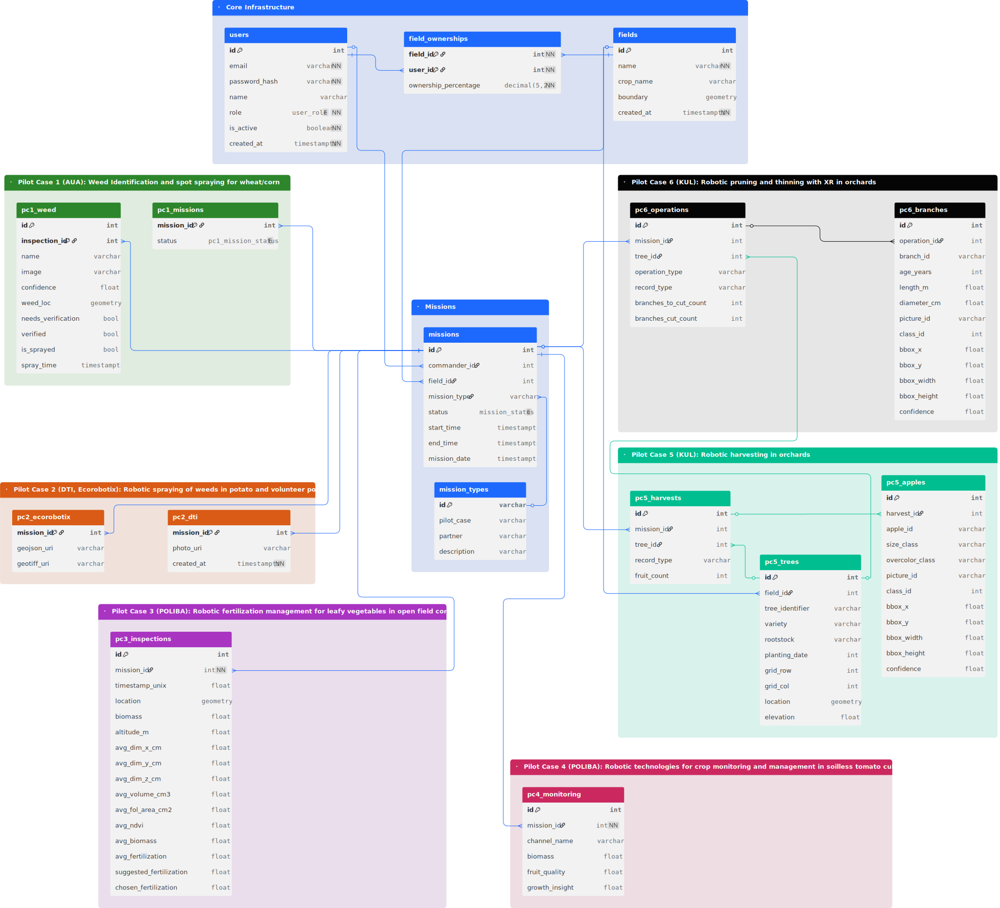

# AgriBot Data Lake API Documentation
**ICCS - NTUA**

## Introduction

This document outlines the architecture and usage of the AgriBot Data Lake API. The platform serves as a central hub for agricultural data ingestion, storage, and retrieval, designed to support various robotic missions ranging from spraying to harvesting.

The system is built on **FastAPI** (API Layer), **PostgreSQL + PostGIS** (Relational & Spatial Data), and **MinIO** (Object Storage for Images/Logs).

---

## Table of Contents

1.  [Architecture Overview](#1-architecture-overview)
2.  [Database Schema](#2-database-schema)
3.  [Getting Started](#3-getting-started)
    *   [Local Setup](#local-setup)
    *   [Authentication](#authentication)
4.  [Core Resources](#4-core-resources)
    *   [Farms, Fields & Robots](#farms-fields--robots)
5.  [Use Cases](#5-use-cases)
    *   [🚜 UC1 & UC2: Spraying & Weeding](#-uc1--uc2-spraying--weeding)
    *   [🌿 UC3 & UC4: Crop Monitoring](#-uc3--uc4-crop-monitoring)
    *   [🍎 UC5 & UC6: Orchards & Harvesting](#-uc5--uc6-orchards--harvesting)
6.  [Image Handling (MinIO)](#6-image-handling-minio)
    *   [The Presigned URL Pattern](#the-presigned-url-pattern)
    *   [Bucket Strategy](#bucket-strategy)

---

## 1. Architecture Overview

<p align="center">
  
</p>

The platform follows a Data Lake architecture:

*   **API Layer (FastAPI):** Handles authentication, data validation, and orchestration. It does *not* handle heavy file streams directly.
*   **Relational Store (PostgreSQL):** Stores structured data, time-series telemetry, and geospatial boundaries (Fields, Trees).
*   **Object Store (MinIO):** Stores unstructured data like high-resolution images, LiDAR point clouds, and raw logs.

---

## 2. Database Schema

<p align="center">
  
</p>

The database is organized into logical groups rather than strict pilot cases, allowing for better data reuse.

*   **Core Infrastructure:** `users`, `farms`, `fields`, `robots`
*   **Spraying (UC1/2):** `uc1_uc2_missions`, `uc1_uc2_telemetry`
*   **Monitoring (UC3/4):** `uc3_uc4_observations`
*   **Orchards (UC5/6):** `uc5_uc6_trees`, `uc5_uc6_harvest_data`, `uc5_uc6_detections`

**Additional Information:**
*   You can view the schema [here](https://dbdiagram.io/d/AgRibot-6849f4b1a463a450da2514f5) 
*   Details about the DB can be found [here](https://dbdocs.io/iloudaros/AgRibot)

---

## 3. Getting Started

### Local vs Production Setup
To start experimenting with the API:
1.  Visit the repository of the [AgriBot Data Lake Local Development Environment](https://github.com/iloudaros/agribot-local)
2.  Follow the instructions to create a local instance of it using [Minikube](https://minikube.sigs.k8s.io/docs/start/?arch=%2Fmacos%2Fx86-64%2Fstable%2Fbinary+download).

*In case you encounter a 404 error with the link above, chances are you are not listed as a contributor at the repository. Please send an email to `iloudaros@microlab.ntua.gr` and we will sort it out.*

For production deployment, please use the infrastructure provided by ICCS.

### Authentication
All API endpoints (except health checks) require a JWT Bearer Token.

**1. Login to get a token:**
```bash
curl -X POST "http://localhost/api/v1/token" \
     -H "Content-Type: application/x-www-form-urlencoded" \
     -d "username=testuser&password=testpassword"
```

**2. Use the token:**
Include the header in all requests: `Authorization: Bearer <your_token>`

---

## 4. Core Resources

Before uploading mission data, the infrastructure must be defined.

### Farms, Fields & Robots
*   **GET /core/farms**: List all farms.
*   **POST /core/robots**: Register a new robot.

---

## 5. Use Cases

### 🚜 UC1 & UC2: Spraying & Weeding
**Context:** Robots traversing a field to spray liquids or mechanically remove weeds.

#### 1. Create Mission Summary
Call this at the **start** or **end** of a mission to initialize the record.
`POST /api/v1/spraying/missions`

```json
{
  "robot_id": 1,
  "field_id": 10,
  "mission_type": "spraying",
  "start_time": "2025-05-18T10:00:00Z",
  "end_time": "2025-05-18T12:00:00Z",
  "travelled_distance_m": 1500.5,
  "covered_area_m2": 5000.0,
  "sprayed_fluid_l": 45.2
}
```

#### 2. Upload Telemetry (Bulk)
Upload high-frequency logs (GPS, speed, pressure) in batches.
`POST /api/v1/spraying/telemetry`

```json
[
  {
    "mission_id": 55,
    "timestamp": "2025-05-18T10:00:01Z",
    "latitude": 46.9593,
    "longitude": 7.1369,
    "speed_mps": 1.2,
    "spray_pressure_bar": 3.0
  }
]
```

---

### 🌿 UC3 & UC4: Crop Monitoring
**Context:** Robots scanning crops (Leafy vegetables, Tomatoes) to measure growth indices like NDVI or Biomass.

#### 1. Upload Field Observation
`POST /api/v1/monitoring/observations`

```json
{
    "robot_id": 2,
    "field_id": 5,
    "timestamp": "2025-06-10T08:30:00Z",
    "latitude": 41.1398,
    "longitude": 16.7983,
    "avg_ndvi": 0.72,
    "avg_foliage_area_cm2": 603.2,
    "raw_data_json": { "avg_volume_cm3": 22333.1 }
}
```

---

### 🍎 UC5 & UC6: Orchards & Harvesting
**Context:** Managing individual trees, harvesting fruit, and running AI detections on images.

#### 1. Register a Tree
Map a physical tree tag (e.g., QR code) to a GPS location.
`POST /api/v1/orchards/trees`

```json
{
  "field_id": 3,
  "tree_identifier": "MALUS-GALA-101",
  "variety": "Gala",
  "latitude": 46.4981,
  "longitude": 11.3489
}
```

#### 2. Upload Fruit Detections
After uploading an image (see Section 6), submit the AI results.
`POST /api/v1/orchards/images/{image_id}/detections`

```json
[
  {
    "class_name": "apple",
    "confidence": 0.98,
    "x": 631.5,
    "y": 1306.5,
    "width": 95,
    "height": 91
  }
]
```

---

## 6. Image Handling (MinIO)

We use MinIO for storing large files. To ensure high performance, we use **Presigned URLs**. This allows the Connector to upload files directly to the storage server, bypassing the API bottleneck.

### The Presigned URL Pattern

Afto to ksanavlepoume.

1.  **Request URL:** The Connector calls `POST /api/v1/orchards/images/presigned-url` with the filename.
2.  **Upload:** The API returns a temporary URL. The Connector performs a `PUT` request to this URL with the binary image data.
3.  **Confirm:** The Connector calls `POST /api/v1/orchards/images/confirm` to tell the API the upload is finished. The API then saves the metadata to PostgreSQL.


